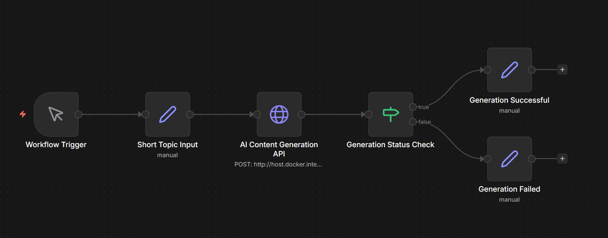

# AI Shorts Engine
### Local Autonomous YouTube Shorts Generation Pipeline

An **end-to-end locally running AI video generation system** that automatically creates short vertical videos from a topic input.

Unlike most AI content tools, this system runs **entirely on local infrastructure** and does **not depend on external AI APIs**. All core generation tasks — script writing, voice narration, image creation, and video assembly — are executed using locally hosted models and tools.

This makes the system:

- **Offline capable**
- **API-independent**
- **Self-hosted**
- **Automation ready**
- **Fully controllable**

The pipeline integrates **local LLMs, generative media models, and workflow automation** to produce a fully autonomous short-video generation engine.

---

# Key Highlights

• Fully **local AI pipeline**  
• **No cloud AI APIs required**  
• Automated **script → video generation**  
• **Stable Diffusion based visuals**  
• **Neural narration synthesis**  
• **Automated workflow orchestration (n8n)**  
• **FastAPI service interface**  
• Designed for **offline-first AI content creation**

This system demonstrates how modern AI tools can be orchestrated to build a **self-contained automated media generation pipeline**.

---

# System Architecture

The system follows a modular architecture where each stage of the pipeline performs a specialized task.

```

User Topic
↓
Ollama (Local LLM Script Generation)
↓
Scene Engine (Script → Structured Scenes)
↓
Audio Engine (Neural Voice Narration)
↓
Image Engine (Stable Diffusion Visuals)
↓
Video Engine (Scene Assembly + Background Music)
↓
Final MP4 Output
↓
FastAPI Endpoint (/generate)
↓
n8n Workflow Automation

```

Each module is isolated and communicates through structured data outputs, making the system easy to extend or modify.

---

# Workflow Automation

The generation pipeline is orchestrated using **n8n**, a self-hosted automation platform.

The workflow performs the following tasks:

1. Accepts a topic input
2. Sends the topic to the FastAPI backend
3. Triggers the AI generation pipeline
4. Validates pipeline response
5. Returns success or failure information

### n8n Workflow



This workflow structure enables future extensions such as:

- scheduled video generation
- multi-topic batch generation
- integration with publishing platforms
- content automation pipelines

---

# Core Technologies

This project combines multiple AI and media processing technologies into a unified system.

---

## Ollama (Local LLM)

Model used:

```

mistral

```

Purpose:

- Generates structured script content
- Produces hooks, body text, and scene prompts
- Outputs structured JSON used by the pipeline

Advantages:

- Runs locally
- No API keys required
- Offline capable
- Fast response times

Default service endpoint:

```

[http://localhost:11434](http://localhost:11434)

```

---

## Stable Diffusion

Model used:

```

runwayml/stable-diffusion-v1-5

```

Used for:

- generating visual images for scenes
- converting prompts into cinematic visuals

Model size:

```

~5.5GB

```

Current configuration:

- CPU-based inference
- integrated through HuggingFace Diffusers

Image generation output:

```

1920x1080 images

```

Images are later scaled and formatted during video assembly.

Performance is strongly dependent on:

- CPU performance
- RAM availability
- optional GPU acceleration

---

## Edge-TTS

Edge-TTS is used for neural voice synthesis.

Features:

- high quality neural voices
- adjustable speech speed
- adjustable volume
- fast audio generation

Each scene generates an independent narration track that is later merged into the final video.

---

## FFmpeg

FFmpeg is responsible for video rendering and assembly.

Responsibilities include:

- converting images into video clips
- synchronizing narration with scenes
- mixing background music
- concatenating scene segments
- encoding final video output

Current encoding settings:

```

Resolution : 1280x720
Frame Rate : 25 FPS
Video Codec: H264
Audio Codec: AAC
Format     : MP4

```

---

## FastAPI Backend

FastAPI exposes the entire pipeline as an HTTP service.

Primary endpoint:

```

POST /generate

```

Example request:

```

[http://localhost:8000/generate?topic=BlackHoles](http://localhost:8000/generate?topic=Black Holes)

```

The API performs the following:

- triggers the AI generation pipeline
- returns pipeline status
- returns generated video path

FastAPI enables:

- automation
- remote triggering
- workflow integration

---

## n8n Automation

n8n serves as the orchestration layer for this project.

Deployment mode:

```

Docker self-hosted

```

The workflow sends HTTP requests to the FastAPI backend.

Since n8n runs in Docker, it accesses the host machine using:

```

[http://host.docker.internal:8000](http://host.docker.internal:8000)

```

This allows the container to communicate with the local API server.

---

# Project Structure

```

shorts-engine/
│
├── scripts/
│   ├── script_engine.py
│   ├── scene_engine.py
│   ├── audio_engine.py
│   ├── image_engine.py
│   ├── video_engine.py
│   ├── pipeline.py
│   ├── api_server.py
│   ├── config.py
│   ├── schema.py
│   └── utils.py
│
├── assets/
│   ├── audio/      # generated narration files
│   ├── images/     # generated images
│   ├── music/      # optional background track
│   ├── temp/       # temporary video segments
│   └── output/     # final rendered videos
│
├── workflow/
│   └── n8n_workflow.png
│
├── requirements.txt
├── .gitignore
└── README.md

```

Generated media files are excluded from Git using `.gitignore`.

---

# Installation Guide

## Clone Repository

```

git clone <https://github.com/LavanuruRohithRoy/auto-scene-generator.git>
cd shorts-engine

```

---

## Create Virtual Environment

```

python -m venv venv

```

Activate environment:

Windows:

```

venv\Scripts\activate

```

Verify Python location:

```

where python

```

Expected:

```

shorts-engine\venv\Scripts\python.exe

```

---

## Install Dependencies

```

pip install -r requirements.txt

```

---

# Install Ollama

Download and install Ollama.

Pull the required model:

```

ollama pull mistral

```

Start the Ollama service:

```

ollama serve

```

The LLM will now be accessible locally.

---

# Running the Pipeline

You can run the pipeline directly for testing.

```

python scripts/pipeline.py

```

This process will:

1. Generate script
2. Build scene structure
3. Generate narration
4. Generate images
5. Assemble video

Output location:

```

assets/output/final_video.mp4

```

---

# Running the API Server

Start the FastAPI server.

```

python scripts/api_server.py

```

Server address:

```

[http://localhost:8000](http://localhost:8000)

```

Interactive API documentation:

```

[http://localhost:8000/docs](http://localhost:8000/docs)

```

---

# n8n Integration

If n8n is running inside Docker, the API should be accessed using:

```

[http://host.docker.internal:8000/generate?topic=YourTopic](http://host.docker.internal:8000/generate?topic=YourTopic)

```

HTTP method:

```

POST

```

Topic should be passed as a query parameter.

---

# Hardware Requirements

This system is designed to run locally but its performance depends on hardware resources.

Recommended minimum configuration:

```

CPU: 4 cores
RAM: 16 GB
Storage: 20 GB free space

```

Optional improvements:

```

GPU: NVIDIA CUDA compatible GPU
RAM: 32 GB recommended for heavy workloads
SSD: improves model loading speed

```

---

# Performance Expectations

Performance varies depending on system hardware.

Typical CPU-only performance:

| Stage | Estimated Time |
|------|---------------|
| Script Generation | 30–60 seconds |
| Image Generation | 3–6 minutes |
| Audio Generation | <30 seconds |
| Video Assembly | <30 seconds |

Total pipeline time:

```

~5–8 minutes per video

```

GPU acceleration can significantly reduce generation time.

---

# Operational Notes

- Generated media folders are excluded from version control.
- Stable Diffusion loads once per pipeline execution.
- The system should always run inside a virtual environment.
- Ollama must be running before triggering the pipeline.
- Deleting temporary assets is safe between runs.

---

# Known Limitations

Current system version includes several limitations:

- CPU-based image generation
- slideshow-style scene visuals
- limited motion effects
- no subtitle rendering
- no advanced video transitions

---

# Future Improvements

Possible enhancements for future versions include:

- GPU acceleration for Stable Diffusion
- animated camera motion
- subtitle generation
- improved prompt engineering
- scene coherence improvements
- parallel generation pipeline
- automated YouTube publishing
- thumbnail generation automation

---

# Final Output

Generated videos are stored at:

```

assets/output/final_video.mp4

```

The system produces **vertical short-form videos ready for publishing**.

---

# License

This project is intended for **educational and experimental use**.
